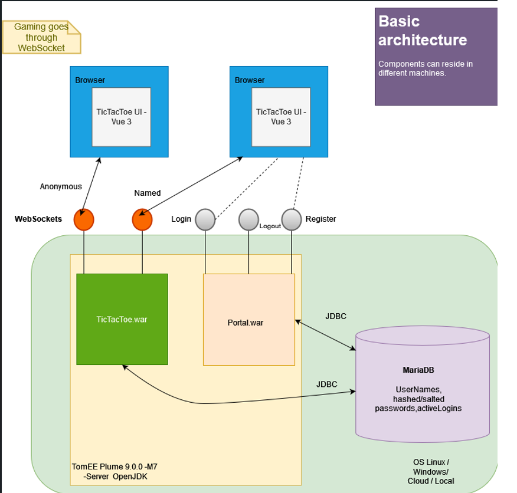
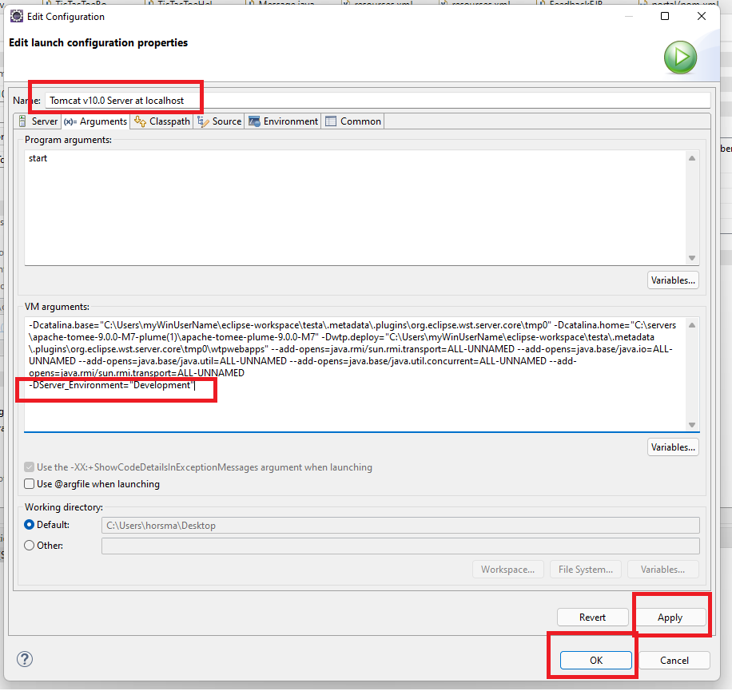

# 22.1.2022     TicTacToe: play online with other players or against unfinished AI. Various board sizes.

## Table of contents
* [Keywords](#Keywords)
* [Project goals](#Projectgoals)
* [Architecture](#architecture)
* [Youtube-link](#link)
* [Disclaimer](#disclaimer)
* [Technical setup](#Setup)

## Keywords, used technologies and software
Windows 10/11 64-bit, 
MariaDB 10.6.3, 
HeidiSQL 11.3.0.6295,  
Eclipse(Version: 2021-06 (4.20.0) Build id: 20210612-2011),  
TomEE plume 9.0.0-M7, (Milestone version 7)  
Java OpenJDK 16, (compiler Java 12),  
Visual Studio Code (1.62), 
Node v14.17.3,  
Vue 3,  
Vuex 4.0.2,
Vue-router 4.0.11,  
Vue-cli: @vue/cli 4.5.15  
Bootstrap 5.1.0

## Architecture

 
 

## Disclaimer
Use at your own risk. No warranties.  
Using, testing, playing, running scripts, installing, deploying any parts of the software is done with your own responsibility and risk. Thus there is no guarantee that this software will work as intended in your environment. Software and instructions might contain bugs/errors.

## Technical setup
Read the whole setup first. This is not a step by step instructions for creating workspace.  
Even if you have done some similarish setups before there might( will) come problems to solve.

Upper level tasks in order to get application running:
1. Create database with a script and 2 users manually. 
2. Setup backend dev env
3. Use browser to test current version with current UI
4. Setup UI dev env if required/ want to change UI. Publish changes to DIST-folder using npm-build.
5. Prod-publish: Copy DIST-folder to Eclipse portal-project. Deploy Portal.war and TicTacToe.war to server running prod TomEE and database.
   Set Server launch environment to  -DServer_Environment="Production" Compare to  2.7
---
1. **Create database with script**  
1.1  Db-view from HeidiSql      
1.2 Script "games_portal_v7.sql" is in root folder. It can be run for example from HeidiSQL -> File -> Load SQL file. Read through the script version before running it. 
1.3 TicTacToe.war and Portal.war need user IDs in order to access database. Later on the backend is connected to db using these (resources.xmls in Eclipse). Users can be created directly from MariaDB command line or from HeidiSQL -> Tools -> User manager (HeidiSQL might need some plugin to work). 
Create new users "gameportal-api" for Portal.war and "tictactoe-api" TicTacToe.war. Grant user rights "Execute","Select","Update","Insert" for games_portal database. Same Usernames and passwords will be required later when setting up backend.  
2. **Setup backend dev env with Eclipse**  
2.1 Import backend projects portal and tictactoe into Eclipse as Maven-projects.  
2.1.1 Right click portal and tictactoe projects -> Maven-> Update project (to fetch configured deps)  
2.2 Windows-> preferences -> Validations -> Disable JavaScript validations for errors on problems tab. Clean all projects "Project -> Clean.." 
2.3 No direct errors should occur in problems tab. Create server: Click Window -> Show view -> Other -> Servers -> Create new  
2.3.1 Attach TomEE Plume Server Files from directory where you downloaded them. https://tomee.apache.org/download.html 
Plume does not have separate server runtime adapter in Eclipse(2021) so runtime enviroment is ok to be Apache Tomcat v.10.0  
2.3.2   
2.4 Start empty server (check logs for errors, no errors should occur).  
2.4 Open resources.xml in both of the projects. Find "TODO password" and type your passwords from create database section.
2.5 Add both "tictactoe" and "portal" projects to server and clean/restart server. Check console logs for errors after startup.  
2.6 Open browser http://localhost:8081/portal/index.html   
2.7 Add Server "Open launch configuration" -DServer_Environment="Development"  

2.8 Set Feedback file path and name. Feedbacks go to file appending it endlessly. Biggest file size not configured.
	Find FeedbackEJB.java -> set fileNameLocal and fileNameProd to point what files you want use.  
2.9 Set context root for "portal" and "tictactoe" projects  
  
3. ** Use browser to test current UI-version **  
3.1 Open browser from address http://localhost:8081/portal/index.html
    Check that port matches your server, check logs from Eclipse if errors occur.  
    Check browser console if errors occur.
    UI should open up now.   Test WebSocket connection from "play" link. If not working check "tictactoe"-project file Constants.java and variable WEBSOCKET_LOCALHOST_ORIGIN matches with browser port.
3.2 Try registering new username. Username and password are not allowed to be the same. Check browser dev-tools
	that address is http://localhost:8081/portal/api/user/register   
3.3 Try Login with the credentials.  
3.4 Click play link and check WebSocket connection is opened ws://localhost:8081/tictactoe/ws  

4. ** Setup UI dev env if required to change UI. **    
        4.1 Sections 1-3 are required to be done before to get backend **services** working since they are running in port 8081.  
	4.1.2 UI tries to get services on many UI-views from backend server created in section 2.  
  	4.2 Visual studio code can be used to edit UI-files. -> Import "frontend" folder to VsCode.  
  	4.3 Vue-cli has been used within development -> https://cli.vuejs.org/guide/installation.html
  	4.4 Run "npm install" to get packages from folder where package.json is located. Latest versions of the package check? Consider installing globally with -g.  
  	4.5 Find .env.local file -> set VUE_APP_API_BASE_URL and VUE_APP_WS_URL corresponding where backend services are configured.  
         For example: http://localhost:8081  and websocket ws://localhost:8081/tictactoe/ws  
  	4.6 Backend should give "CORS-headers" accordingly, browser makes http OPTIONS call since port 8080!=8081  
  
  4.7 Run "npm run serve" to start dev server. Vue-App runs default at http://localhost:8080/ (note port)  
  4.8 Since Now running UI in port 8080 -> Backend given cors headers do not match. Find Constants.java file  
      In Eclipse, click ctrl+shift+T -> Type Constants.java and select one from TicTacToe project.
	  Change variable to WEBSOCKET_LOCALHOST_ORIGIN = "http://localhost:8080"; note the port 8080. Restart backend server.  
  4.9 Make wanted changes -> For example Home.vue text changes. 
  4.10 To build package in order to use it prod environment run "npm run build. Copy created Dist folder contents  
	  to Eclipse Portal-project and delete old/unnecessery UI-files. Build uses .env.production values and overrides URLs within build.

5. Prod deployment from Eclipse:  
 5.0 Check that folder src->main->webapp-> contains correct UI-files (Bootstrap, JavaScript files etc.
	5.1 Select "portal"-project ->  File -> Export -> war-file. Check contents inside .war file are in correct places.  
	5.2 Select tictactoe-project >  File -> Export -> war-file. Check contents inside .war file are in correct places. 
	5.3 Double check inner contents of both .war files, that they don't contain unwanted files and that files are
	 in correct places. Source-files should not be in .war file and classes should be WEB-INF/lib folder.
	5.4 Move the .war files to production server -> test.
